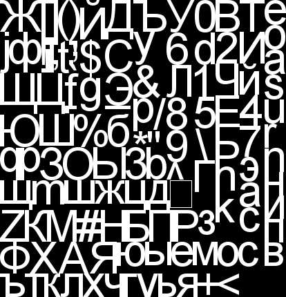

font-rasterizer
===============

```cpp
FontRasterizer* fr = new FontRasterizer();

fr->ReadFontFile("arial.ttf");

fr->AddGlyphRange(0, 128);
fr->AddGlyphRange(0x410, 0x44f);
fr->SetSize(64);
fr->Rasterize();
//After that you still can AddGlyphs() and Rasterize() again. Updated atlas will be composed.

Bitmap bmp = fr->GetBitmapData();
GlyphInfo gi = fr->GetGlyph(32);

delete fr;
```
